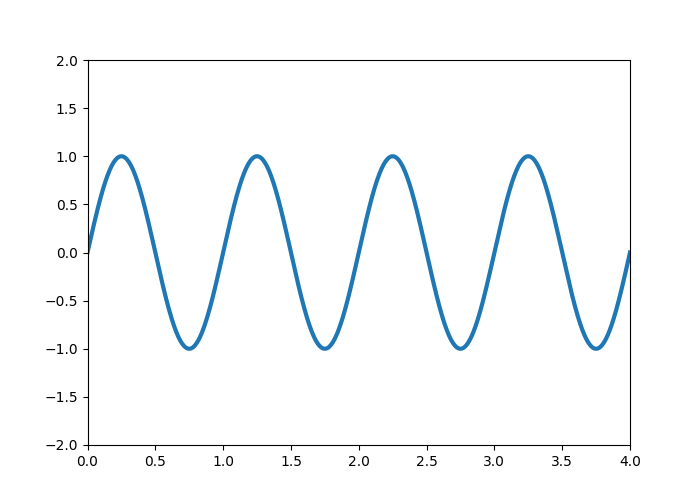

# Introduksjon

Da jeg først lærte om kalkulus på skolen var jeg ikke var jeg ikke klar over at
det var tilfelle. Jeg tror ikke jeg er er den eneste som opplevde dette. Hvis du
leser denne artikkelen er det mulig at du enda ikke vet at du lærer kalkulus.

Kort fortalt er kalkulus derivasjon og integrasjon, men for å gjennomføre disse
operasjonene kreves funksjoner, grenseverdier og uendelige følger og rekker. 
Kalkulus er et av de viktigste verktøyene for å forstå og analysere funksjoner 
og hva funksjonene modellerer. Dette er fordi kalkulus forteller hvordan forholdet
mellom *momentan endring* og *total endring*. Hvis vi klarer å beskrive hvordan 
noe endrer seg kan vi med kalkulus beskrive hvor det ender opp. Dette vil bli
tydligere senere.

# Den deriverte
"Den deriverte" til en funksjon er *endringshastigheten* dens. Vi kan forstå
dette geometrisk som hvor bratt tangenten til grafen er på et gitt punkt:


```{r, include=FALSE}
Sys.setenv(RETICULATE_PYTHON = "/opt/homebrew/bin/python3")
library('reticulate')
```

```{r, engine='python', echo=FALSE}
import numpy as np
import matplotlib.pyplot as plt

def f(x):
  return x**2

def fprim(x):
  return 2*x


xs = np.linspace(-3,3,1000)
ys = f(xs)

plt.plot(xs, ys)
plt.show()
```

```{python, cahce=TRUE}
import numpy as np
from matplotlib import pyplot as plt
from matplotlib.animation import FuncAnimation

fig = plt.figure()
ax = plt.axes(xlim=(0, 4), ylim=(-2, 2))
line, = ax.plot([], [], lw=3)


def init():
    line.set_data([], [])
    return line,

def animate(i):
    x = np.linspace(0, 4, 1000)
    y = np.sin(2 * np.pi * (x - 0.01 * i))
    line.set_data(x, y)
    return line,

anim = FuncAnimation(fig, animate, init_func=init,
                               frames=200, interval=20, blit=True)
anim.save('sine_wave.gif', writer='ffmpeg')
```



