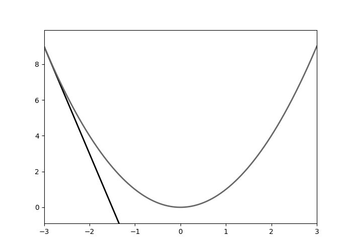
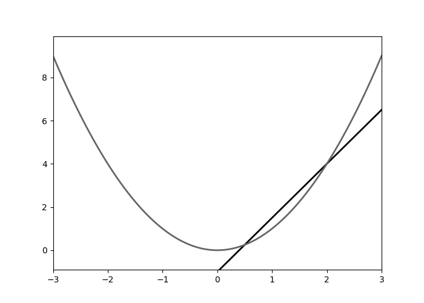

# Introduksjon

Da jeg først lærte om kalkulus på skolen var ikke klar over at
det var tilfelle. Jeg tror ikke jeg er er den eneste som opplevde dette. Hvis du
leser denne artikkelen er det mulig at du enda ikke vet at du lærer kalkulus.

Kort fortalt er kalkulus derivasjon og integrasjon, men for å gjennomføre disse
operasjonene kreves funksjoner, grenseverdier og uendelige følger og rekker. 
Kalkulus er et av de viktigste verktøyene for å forstå og analysere funksjoner 
og hva funksjonene modellerer. Dette er fordi kalkulus forteller hvordan forholdet
mellom *momentan endring* og *total endring*. Hvis vi klarer å beskrive hvordan 
noe endrer seg kan vi med kalkulus beskrive hvor det ender opp. Dette vil bli
tydligere senere.

# Den deriverte
"Den deriverte" til en funksjon er *endringshastigheten* dens. Vi kan forstå
dette geometrisk som hvor bratt tangenten til grafen er på et gitt punkt. 
Animasjonen under illustrere hvordan tangentene til funksjonen
$$
f(x) = x^2
$$


```{r, include=FALSE}
Sys.setenv(RETICULATE_PYTHON = "/opt/homebrew/bin/python3")
library('reticulate')
```

```{python, echo=FALSE}
# short script which plots takes a function and its
# derivative and returns the tangent function at x1

import numpy as np
import matplotlib.pyplot as plt


x1 = 2

def f(x):
  return x**2

def fprim(x):
  return 2*x


def tangent(x1, f, fprim):
    a = fprim(x1)
    b = f(x1) - a*x1
    return lambda x: a*x + b

xmin, xmax = -3, 3
xs = np.linspace(xmin,xmax,1000)
frame_xs = np.linspace(xmin,xmax, 300)
ys = f(xs)

dif = abs(ys.max() - ys.min())
ylims = [ys.min() - dif*0.1, ys.max() + dif*0.1]

t = tangent(x1, f, fprim)


from matplotlib.animation import FuncAnimation
#plt.style.use('seaborn-pastel')
plt.style.use('grayscale')


fig = plt.figure()
ax = plt.axes(xlim=(xmin, xmax), ylim=ylims)
line, = ax.plot([], [], lw=2)

# setting base graph


def init():
    line.set_data([], [])
    return line,

def animate(i):
    t = tangent(i, f, fprim)
    y = t(xs)
    line.set_data(xs, y)
    return line, 
line2, = ax.plot(xs, ys, lw=2)
anim = FuncAnimation(fig, animate, init_func=init,
                               frames=frame_xs, interval=1, blit=True)

anim.save('tangent.gif', writer='ffmpeg')

```

<center>

</center>

For å finne en tangent trenger vi kun to ting: punktet der tangenten treffer 
kurven samt stigningstallet. Tangeringspunktet er lett å finne, vi kan nemlig 
bare evaluere funksjonen. Vi velger å kalle interessepunktet for
$$
(x_1, y_1)
$$
Og 
$$ f(x_1) = y_1$$
Dessverre er stigningstallet mye vanskeligere å finne, men vi kan prøve noe 
omtrentlig, og se hvor langt vi kommer. I steden for å lage en tangent, kan vi
heller lage en korde: en linje som skjærer funksjonen på to steder. Med to
punkter kan vi lett finne linjen som går gjennom. Gitt to punkter 
$$
(x_1, y_1)\\
(x_2, y_2)
$$
Kan vi vinne stigningstallet, $a$, med denne enkle formlen:
$$ a = \frac{y_2 - y_1}{x_2-x_1} = \frac{\Delta y}{\Delta x}$$
'$\Delta$' er den gammelgreske bokstaven for 'd' og i matematikken symboliserer
*differansen* mellom de to punktene i henholdsvis y-retning og x-retning. Geometrisk
kan dette tolkes som forholdet mellom høyden og bredden til trekanten som dannes
av de to punktene:

```{python, echo=FALSE,results='hide'}
x1 = 0.5
x2 = 2

# ensure x1 is the smallest value
if x2 < x1:
  x1, x2 = x2, x1
elif x1 == x2:
  print('MISTAKE')

y1, y2 = f(x1), f(x2)

if y1 < y2:
  x3, y3 = x2, y1
else:
  x3, y3 = x1, y2
  
plt.figure()
plt.ylim(ylims)
plt.plot(xs, ys)
plt.plot([x1,x2,x3,x1], [y1,y2,y3,y1], c='red')
plt.scatter([x1,x2], [y1,y2], c='red')

```

Denne tilnærmingen kan være god eller dårlig avhengig av hvilke punkter vi velger,
men merk at den blir bedre og bedre desto nærmere de er hverandre (Dette er ikke
alltid tilfelle, noen rare funskjoner har ikke den egenskapen). Animasjonen 
under illustrerer dette:

```{python, echo=FALSE, results='hide'}
def corde(x1, x2=x2, f=f):
  y1 = f(x1)
  y2 = f(x2)
  dy = y2-y1
  dx = x2-x1
  return lambda x: dy/dx*(x-x1) + y1


c = corde(x1)

plt.figure()
plt.plot(xs, c(xs))
plt.ylim(ylims)
plt.plot(xs, ys)

fig = plt.figure()
ax = plt.axes(xlim=(xmin, xmax), ylim=ylims)
line, = ax.plot([], [], lw=2)
# setting base graph

def init():
    line.set_data([], [])
    return line, 

def animate(i):
    t = corde(i)
    y = t(xs)
    line.set_data(xs, y)
    return line, 
line2, = ax.plot(xs, ys, lw=2)
anim = FuncAnimation(fig, animate, init_func=init,
                               frames=np.linspace(x1,x2-0.1,100), interval=1, blit=True)
                               
anim.save('limit.gif', writer='ffmpeg')
                          
```

<center>

</center>

Matematisk kan vi si at grenseverdien til korden  når $x_1$ og $x_2$ går mot 
hverandre er tangenten. Vi kan uttrykke det slik:
$$
\lim_{x_1 \to x_2} \frac{f(x_2) - f(x_1)}{x_2 - x_1} = a
$$

Der $a$ er stigningstallet til tangenten. Før vi går videre kan det være lurt å
redefinere $x_2$ til $x + \Delta x$ og så lar vi $x_1$ bare være $x$. Da blir uttrykket slik:

$$
\lim_{\Delta x \to 0} \frac{f(x + \Delta x) - f(x)}{\Delta x} = f'(x)
$$

Den deriverte er altså denne grenseverdien, og vi kaller den for $f'(x)$. For
å fullføre denne introduksjonen til derivasjon, kan vi gjennomføre utregninen med
funksjonen vår $f(x) = x^2$:

$$
\begin{aligned}
\lim_{\Delta x \to 0} \frac{f(x + \Delta x) - f(x)}{\Delta x} &= 
\lim_{\Delta x \to 0} \frac{(x + \Delta x)^2 - x^2}{\Delta x}\\
&= \lim_{\Delta x \to 0} \frac{x^2 +2x\Delta x + (\Delta x)^2 - x^2}{\Delta x}\\
&= \lim_{\Delta x \to 0} \frac{2x\Delta x + (\Delta x)^2}{\Delta x}\\
&= \lim_{\Delta x \to 0} 2x + \Delta x\\
&= 2x
\end{aligned}
$$

Vi ser altså at den deriverte funksjoen til $f(x)=x^2$ er den lineære funksjoen 
$f'(x) = 2x$. Merk at den deriverte er en ny funksjon. Dette er fordi stigningstallet
til $f$ endrer seg ettersom $x$ endrer seg. For akkurat denne funksjonen betyr det
at den er dobbelt så bratt som x-verdien. Videre kan man tenke seg hvordan man kan
derivere andre funksjoner, for eksempel $f(x) = x^3$ og så videre.


